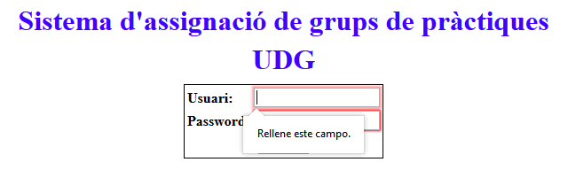
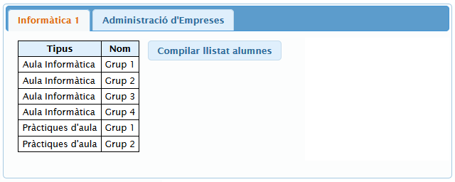
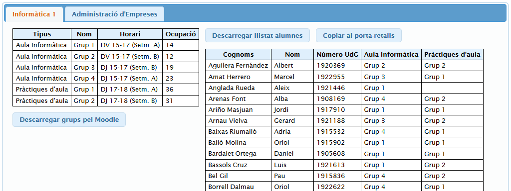
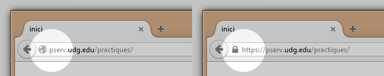
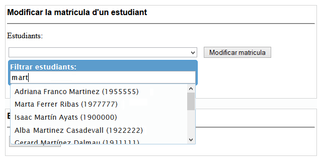

Ajudant-Grups-EPS
=================

Un script de [GreaseMonkey] per millorar la usabilitat de l'aplicació web per gestió de grups d'alumnes a l'[EPS] de la [Universitat de Girona (UdG)]

[GreaseMonkey]:http://es.wikipedia.org/wiki/Greasemonkey
[EPS]:http://eps.udg.edu
[Universitat de Girona (UdG)]:http://www.udg.edu

Motivació
---------
Sovint els professors de l'EPS obtenim els llistats d'alumnes assignats a cada grup de classe via una aplicació web força antiga. En no tenir accés al codi del servidor, s'ha desenvolupat aquest script per simplificar la obtenció de tots aquests llistats. L'script es pot instal·lar als navegadors Firefox i Chrome de l'ordinador de tot professor interessat.

Instal·lació
------------
En primer lloc cal tenir instal·lada una extensió al navegador que es vol fer servir:
  - Per Firefox l'extensió és **GreaseMonkey**: https://addons.mozilla.org/en-US/firefox/addon/greasemonkey/
  - Per Chrome l'extensió és **TamperMonkey**: https://chrome.google.com/webstore/detail/tampermonkey/dhdgffkkebhmkfjojejmpbldmpobfkfo

Una vegada instal·lada l'extensió és molt fàcil instal·lar l'script:
  - Fer clic sobre el fitxer `Ajudant_Grups_EPS.user.js` llistat més a dalt
  - Fer clic sobre el botó **Raw** que hi ha a la dreta
  - Acceptar la instal·lació de l'script al navegador

Ús
--
L'script es posarà en marxa quan es visiti una URL corresponent a la aplicació web. Una manera molt senzilla de comprovar si està funcionant és intentar iniciar sessió sense escriure el nom d'usuari o la contrasenya. El navegador ens indicarà que cal escriure totes dues coses abans de continuar (el comportament original era obtenir un críptic missatge d'error).

Una vegada iniciada la sessió, a sota del selector de grup original es veuran una o més pestanyes (una pestanya per assignatura), una taula amb la llista de grups i un botó "*Compilar llistat alumnes*". 

Fent clic sobre el botó, s'amplia la informació a la taula de grups i s'obté una nova taula amb les dades dels alumnes. També apareixen tres nous botons:
  - El botó **Descarregar grups pel Moodle** permet obtenir un fitxer de text que es pot importar al Moodle de la UdG per no haver de crear els grups un a un. Es recomana revisar el fitxer abans de fer-ho servir.
  - El botó **Descarregar llistat alumnes** permet un fitxer CSV (que es pot obrir directament amb Excel) amb el llistat d'alumnes i les seves assignacions.
  - El botó **Copiar al porta-retalls** còpia la mateixa informació del fitxer CSV al porta-retalls del sistema operatiu de forma que si ja es té obert un full de càlcul es pot enganxar sense haver de fer servir cap fitxer addicional.

Funcionalitat extra
-------------------
A més de la indicació sobre el nom d'usuari i la contrasenya ja comentada, l'script s'assegura de que es fa servir una connexió segura (canviant si cal `http://` per `https://` a les URLs).

A més, si el professor és coordinador d'un estudi, es trobarà una interfície més complicada. Un detall particularment incòmode d'aquesta interfície és trobar un alumne en particular al desplegable de l'apartat "*Modificar la matrícula d'un estudiant*". S'ha afegit un filtre just a sota del selector que permet buscar els alumnes per nom, cognom o ID.

Llicencia
----
MIT
